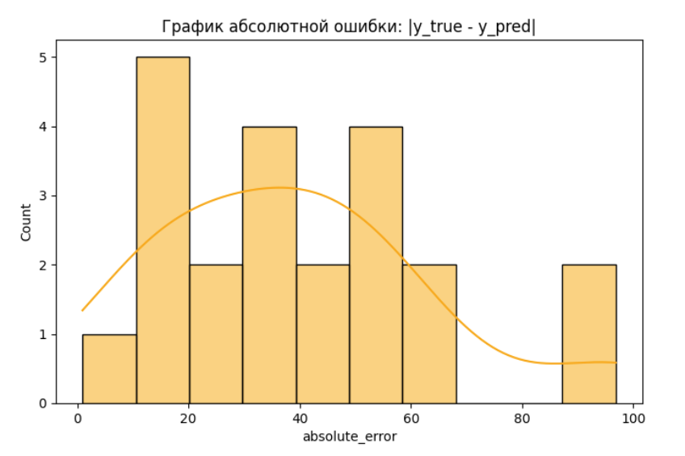

**Бизнес-применение машинного обучения**

1. Описание проекта
Данный проект демонстрирует применение микросервисной архитектуры для построения системы машинного обучения. Основная цель — организовать поток обработки данных от их генерации до анализа предсказаний модели с визуализацией результатов в режиме реального времени.
2.  Структура проекта:
```
microservice_architecture/
├── features/
│   ├── src/
│   │   ├── features.py         # Сервис генерации данных (признаки, истинные значения)
│   ├── Dockerfile              # Docker-образ для сервиса features
│   ├── requirements.txt        # Зависимости Python
├── logs/
│   ├── error_distribution.png  # График распределения абсолютных ошибок
│   ├── labels_log.txt          # Логи данных из очередей
│   ├── metric_log.csv          # Логи метрик (истинные, предсказанные значения и ошибки)
├── metric/
│   ├── src/
│   │   ├── metric.py           # Сервис обработки метрик (абсолютные ошибки)
│   ├── Dockerfile              # Docker-образ для сервиса metric
│   ├── requirements.txt        # Зависимости Python
├── model/
│   ├── src/
│   │   ├── model.py            # Сервис предсказания данных
│   │   ├── myfile.pkl          # Обученная модель (pickle файл)
│   │   ├── myfile.pkl:Zone.Identifier
│   ├── Dockerfile              # Docker-образ для сервиса model
│   ├── requirements.txt        # Зависимости Python
├── plot/
│   ├── src/
│   │   ├── plot.py             # Сервис визуализации ошибок
│   ├── Dockerfile              # Docker-образ для сервиса plot
│   ├── requirements.txt        # Зависимости Python
├── docker-compose.yml          # Конфигурация для запуска всех сервисов
├── README.md                   # Описание проекта
```

3. Архитектура системы. Реализованы четыре микросервиса:                        
    3.1. ```features``` — генерирует данные и отправляет:              
        Признаки (```features```) в очередь features.               
        Истинные значения (```y_true```) в очередь ```y_true```.                      
    3.2. ```model``` — подписан на очередь features:                    
        Слушает очередь features, извлекает признаки.               
        Выполняет предсказание с помощью модели (```model.pkl```).              
        Отправляет предсказанное значение в очередь y_pred.                         
    3.3. ```metric``` — подписан на очереди ```y_true``` и ```y_pred```:                    
        Слушает очереди ```y_true``` и ```y_pred```.                            
        Сопоставляет предсказанные и истинные значения по ключу.                
        Вычисляет абсолютные ошибки.                            
    3.4. ```plot``` — визуализирует абсолютные ошибки:                          
        Читает ```logs/metric_log.csv``` в режиме реального времени.            
        Строит и обновляет график распределения абсолютных ошибок (```logs/error_distribution.png```).                                          
        Сохраняет результаты в ```logs/metric_log.csv```.                                    


4. График распределения абсолютных ошибок:
 

